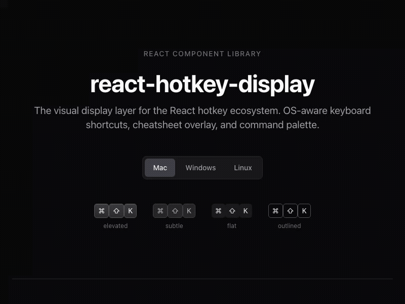

<p align="center">
  
</p>

<h1 align="center">react-hotkey-display</h1>
<p align="center">The visual display layer for the React hotkey ecosystem.</p>

<p align="center">
  
</p>

<p align="center">
  <a href="https://npmjs.com/package/react-hotkey-display"></a>
  <a href="https://bundlephobia.com/package/react-hotkey-display"></a>
  
</p>

<p align="center">
  <a href="https://react-hotkey-display.mulkatz.dev"><strong>Live Demo</strong></a> · <a href="#install">Install</a> · <a href="#components">Components</a>
</p>

## Features

- **Automatic OS detection** — `Mod+S` renders as `⌘S` on Mac, `Ctrl + S` on Windows
- **Mac symbols** — `⌘` `⇧` `⌥` `⌃` `⏎` `⌫` `⇥` `⎋` and more
- **5 components** — `<Kbd>`, `<Hotkey>`, `<ShortcutHint>`, `<ShortcutCheatsheet>`, `<ShortcutPalette>`
- **Command Palette** — `⌘K`-style searchable command list with keyboard navigation
- **Cheatsheet Overlay** — grouped, searchable shortcut reference
- **3 size variants** — sm, md, lg
- **4 visual themes** — elevated (macOS-style), subtle (GitHub-style), flat, outlined
- **Unstyled mode** — `unstyled` prop strips all CSS classes, keeps semantic HTML
- **Accessible** — semantic `<kbd>` elements, ARIA labels, combobox pattern, screen reader friendly
- **SSR-safe** — works with Next.js via `useSyncExternalStore`
- **Works with any hotkey library** — `normalizeCombo()` converts TanStack, react-hotkeys-hook, and tinykeys formats
- **Tiny** — ~3.8KB JS gzipped, modular CSS

## Install

```bash
npm install react-hotkey-display
```

## Quick Start

```tsx
import { Hotkey } from 'react-hotkey-display';
import 'react-hotkey-display/styles.css';

function App() {
  return (
    <div>
      <p>Save: <Hotkey combo="Mod+S" /></p>
      <p>Search: <Hotkey combo="Mod+K" /></p>
      <p>Undo: <Hotkey combo="Mod+Z" /></p>
    </div>
  );
}
```

On Mac: `⌘S`, `⌘K`, `⌘Z`
On Windows: `Ctrl + S`, `Ctrl + K`, `Ctrl + Z`

## Components

### `<Hotkey>`

Displays a keyboard shortcut with OS-aware formatting.

```tsx
<Hotkey combo="Mod+Shift+P" />           // ⇧⌘P (Mac) or Ctrl + Shift + P (Windows)
<Hotkey combo="Mod+K" variant="subtle" /> // GitHub-style
<Hotkey combo="G G" />                    // G → G (sequence support)
<Hotkey combo="Mod+K" size="sm" />        // Small variant
<Hotkey combo="Mod+K" unstyled />         // Semantic HTML, no CSS classes
```

| Prop | Type | Default | Description |
|------|------|---------|-------------|
| `combo` | `string` | required | Key combo, e.g. `"Mod+Shift+K"`. Space = sequence separator. |
| `platform` | `'mac' \| 'windows' \| 'linux'` | auto-detect | Override OS detection |
| `variant` | `'elevated' \| 'subtle' \| 'flat' \| 'outlined'` | `'elevated'` | Visual style |
| `size` | `'sm' \| 'md' \| 'lg'` | `'md'` | Size variant |
| `unstyled` | `boolean` | `false` | Omit all `hkd-*` CSS classes |
| `separator` | `string` | `""` (Mac) / `" + "` (Win) | Key separator |
| `className` | `string` | — | Additional CSS class |

### `<Kbd>`

Single key display.

```tsx
<Kbd>⌘</Kbd>
<Kbd variant="subtle">Ctrl</Kbd>
<Kbd size="lg">Enter</Kbd>
```

### `<ShortcutHint>`

Action label paired with its keyboard shortcut.

```tsx
<ShortcutHint action="Save" combo="Mod+S" />
// → "Save  ⌘S" (Mac) / "Save  Ctrl+S" (Win)
```

### `<ShortcutCheatsheet>`

Searchable keyboard shortcut reference overlay using the native `<dialog>` element.

```tsx
import { ShortcutCheatsheet, ShortcutProvider } from 'react-hotkey-display';
import 'react-hotkey-display/styles.css';
import 'react-hotkey-display/cheatsheet.css';

const shortcuts = [
  { id: 'save', combo: 'Mod+S', description: 'Save', category: 'File' },
  { id: 'find', combo: 'Mod+F', description: 'Find', category: 'Edit' },
];

function App() {
  const [open, setOpen] = useState(false);

  return (
    <ShortcutProvider shortcuts={shortcuts}>
      <button onClick={() => setOpen(true)}>Show Shortcuts</button>
      <ShortcutCheatsheet open={open} onOpenChange={setOpen} />
    </ShortcutProvider>
  );
}
```

Shortcuts can be passed directly as a prop or read from the `ShortcutProvider` context.

### `<ShortcutPalette>`

`⌘K`-style command palette with keyboard navigation (Arrow keys + Enter).

```tsx
import { ShortcutPalette, ShortcutProvider } from 'react-hotkey-display';
import 'react-hotkey-display/styles.css';
import 'react-hotkey-display/palette.css';

const shortcuts = [
  { id: 'save', combo: 'Mod+S', description: 'Save', category: 'File', action: () => save() },
  { id: 'find', combo: 'Mod+F', description: 'Find', category: 'Edit', action: () => openFind() },
];

function App() {
  const [open, setOpen] = useState(false);

  return (
    <ShortcutProvider shortcuts={shortcuts}>
      <ShortcutPalette
        open={open}
        onOpenChange={setOpen}
        onSelect={(shortcut) => shortcut.action?.()}
      />
    </ShortcutProvider>
  );
}
```

### `<ShortcutProvider>`

Context provider for sharing shortcuts between components. Not required — all components accept a `shortcuts` prop directly.

```tsx
<ShortcutProvider shortcuts={shortcuts}>
  <App />
</ShortcutProvider>
```

**Hooks:**
- `useShortcuts()` — read all registered shortcuts
- `useRegisterShortcut(entry)` — dynamically register a shortcut (auto-cleanup on unmount)

## Integration with Hotkey Libraries

`normalizeCombo()` converts combo formats from popular libraries to our format:

```ts
import { normalizeCombo } from 'react-hotkey-display';

// tinykeys format
normalizeCombo('$mod+KeyK')     // → "Mod+K"
normalizeCombo('$mod+Digit1')   // → "Mod+1"
normalizeCombo('ArrowUp')       // → "Up"

// TanStack format
normalizeCombo('$mod+KeyS')     // → "Mod+S"

// react-hotkeys-hook format (mostly compatible already)
normalizeCombo('meta+k')        // → "Mod+k"
```

## The `Mod` Key

Use `Mod` as a platform-agnostic modifier:
- **Mac**: renders as `⌘` (Command)
- **Windows/Linux**: renders as `Ctrl`

## Supported Keys

| Input | Mac | Windows |
|-------|-----|---------|
| `Mod` | ⌘ | Ctrl |
| `Ctrl` | ⌃ | Ctrl |
| `Shift` | ⇧ | Shift |
| `Alt` / `Option` | ⌥ | Alt |
| `Enter` | ⏎ | Enter |
| `Backspace` | ⌫ | Backspace |
| `Delete` | ⌦ | Delete |
| `Tab` | ⇥ | Tab |
| `Escape` | ⎋ | Esc |
| `Space` | ␣ | Space |
| `Up/Down/Left/Right` | ↑↓←→ | ↑↓←→ |
| `F1`–`F12` | F1–F12 | F1–F12 |

## Theming

Customize via CSS Custom Properties:

```css
:root {
  --hkd-font: 'Inter', sans-serif;
  --hkd-font-size: 0.75rem;
  --hkd-radius: 6px;
  --hkd-color: #1a1a1a;
  --hkd-bg: #f5f5f5;
  --hkd-border: #e5e5e5;
}
```

All CSS classes use the `hkd-` prefix. Dark mode is supported via `prefers-color-scheme`.

Use `unstyled` prop on any component to strip all `hkd-*` classes while keeping semantic HTML — perfect for building your own styles on top.

## Utility Functions

```ts
import { formatCombo, normalizeCombo, parseCombo, detectPlatform } from 'react-hotkey-display';

const platform = detectPlatform(); // 'mac' | 'windows' | 'linux'
const keys = formatCombo('Mod+Shift+K', platform); // ['⌘', '⇧', 'K'] on Mac
const normalized = normalizeCombo('$mod+KeyK'); // 'Mod+K'
```

| Function | Description |
|----------|-------------|
| `formatCombo(combo, platform)` | Format a full combo string into display keys |
| `formatKey(key, platform)` | Format a single key for a given platform |
| `parseCombo(combo)` | Parse `"Mod+Shift+K"` into `["Mod", "Shift", "K"]` |
| `normalizeCombo(combo)` | Normalize tinykeys/TanStack/react-hotkeys-hook format |
| `getAriaLabel(key)` | Screen reader label for a key symbol |
| `getComboAriaLabel(keys)` | Full screen reader label for formatted keys |
| `detectPlatform()` | Detect user's OS |
| `usePlatform(override?)` | SSR-safe React hook for platform detection |

## SSR / Next.js

The `usePlatform` hook uses `useSyncExternalStore` for hydration-safe platform detection. On the server, it renders as `"windows"`. After hydration, it updates to the detected platform.

```tsx
<Hotkey combo="Mod+S" platform="mac" /> // Skip detection entirely
```

## Browser Support

Works in all modern browsers. `<dialog>` element requires Safari 15.4+ (March 2022).

## License

MIT
